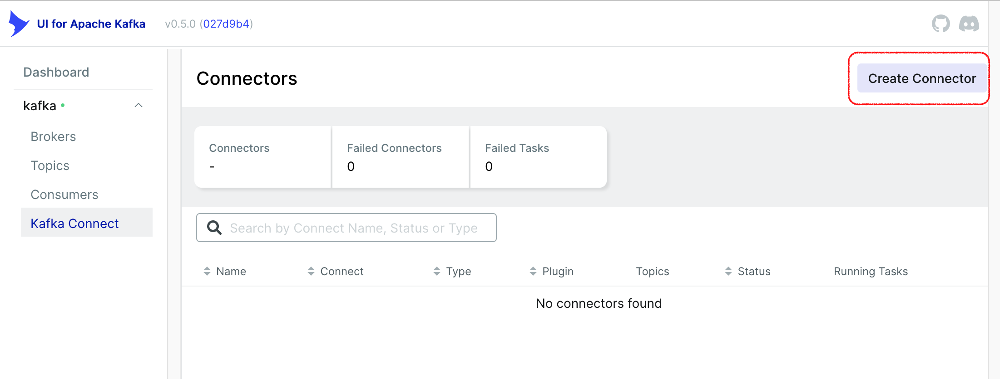
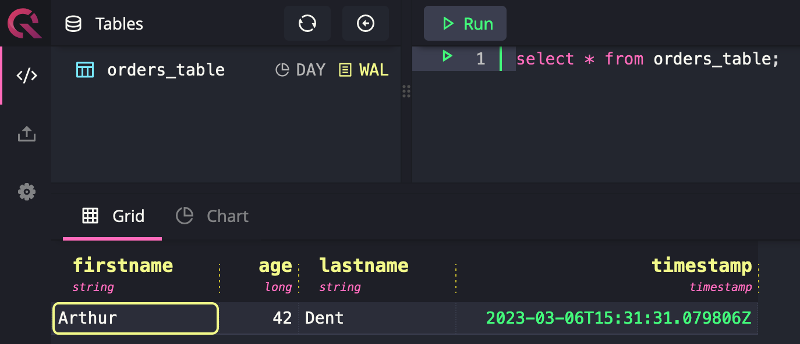

# Sample Project: Confluent Images
This sample project shows how to use the [QuestDB Kafka connector](https://questdb.io/docs/third-party-tools/kafka/questdb-kafka/) together with Confluent Docker images for Kafka.
The sample uses the [Confluent CP Kafka Connect](https://hub.docker.com/r/confluentinc/cp-kafka-connect-base) as a base for 
building a custom Docker image with the QuestDB Kafka connector installed. The QuestDB Kafka connector is installed from the
[Confluent Hub](https://www.confluent.io/hub/questdb/kafka-questdb-connector).


It also uses the [Kafka UI](https://github.com/provectus/kafka-ui) project for Kafka administration. 

## Prerequisites:
- Git
- Working Docker environment, including docker-compose[..](..)
- Internet access to download dependencies

## Usage:
- Clone this repository via `git clone https://github.com/questdb/kafka-questdb-connector.git`
- `cd kafka-questdb-connector/kafka-questdb-connector-samples/confluent-docker-images` to enter the directory with this sample.
- Run `docker compose build` to build a docker image with the sample project.
- Run `docker compose up` to start the node.js producer, Apache Kafka and QuestDB containers.
- The previous command will generate a lot of log messages. Eventually logging should cease. This means both Apache Kafka and QuestDB are running.
- Go to http://localhost:8080/ui/clusters/kafka/connectors and click on the “Create Connector” button.
    
- The connector name should be QuestDB, use the following configuration and click at Submit:
    ```json
  {
    "connector.class": "io.questdb.kafka.QuestDBSinkConnector",
    "topics": "Orders",
    "host": "questdb:9009",
    "name": "questdb",
    "value.converter": "org.apache.kafka.connect.json.JsonConverter",
    "include.key": false,
    "key.converter": "org.apache.kafka.connect.storage.StringConverter",
    "table": "orders_table",
    "value.converter.schemas.enable": false
  }
    ```
- Go to http://localhost:8080/ui/clusters/kafka/all-topics/Orders and click on the “Produce Message” button. If the Topic is not created yet then try to refresh the page.
- Use the following JSON as value, keep the rest of the fields as default and click at “Produce Message”:
    ```json
  {"firstname": "Arthur", "lastname": "Dent", "age": 42}
    ```
- Go to [QuestDB web console](http://localhost:9000) and run the following query:
    ```sql
    select * from orders_table
    ```
- You should see a result similar to this:
    

## How it works
The Docker Compose file starts the following containers:
- Kafka broker - the message broker
- Zookeeper - the coordination service for Kafka
- Kafka Connect - the framework for running Kafka connectors
- QuestDB - the fastest open-source time-series database
- Kafka UI - the web UI for Kafka administration

The Kafka Connect container is built from the [Confluent CP Kafka Connect](https://hub.docker.com/r/confluentinc/cp-kafka-connect-base) by image by using the following Dockerfile:
```dockerfile
FROM confluentinc/cp-kafka-connect-base:7.3.2
RUN confluent-hub install --no-prompt questdb/kafka-questdb-connector:0.6
```
The `confluent-hub` command installs the QuestDB Kafka connector from the [Confluent Hub](https://www.confluent.io/hub/questdb/kafka-questdb-connector).

When all containers are running then we use the Kafka UI to start the QuestDB connector. The connector is configured to read data from a Kafka topic `Orders` and write it to the QuestDB table `orders_table`.

Then we use the Kafka UI to produce a message to the `Orders` topic. The message is a JSON document with the following structure:
```json
{"firstname": "Arthur", "lastname": "Dent", "age": 42}
```
The Kafka Connect container receives the message and writes it to the QuestDB table.

Finally, we use the QuestDB web console to query the table and see the result!

## Further reading
- [QuestDB Kafka connector](https://questdb.io/docs/third-party-tools/kafka/questdb-kafka/)

## Bugs and Feedback
For bugs, questions and discussions please use the [Github Issues](https://github.com/questdb/kafka-questdb-connector/issues/new)