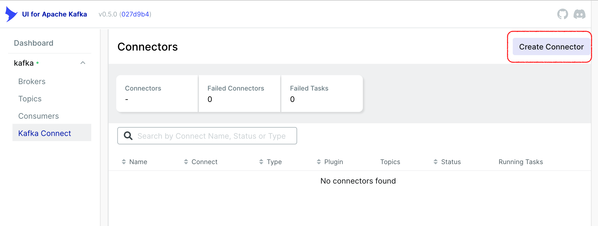

# Sample Project: Confluent Hub install
This sample shows how to install the [QuestDB Kafka connector](https://questdb.com/docs/third-party-tools/kafka/questdb-kafka/)
from the [Confluent Hub](https://www.confluent.io/hub/questdb/kafka-questdb-connector) into the
[Confluent CP Kafka Connect](https://hub.docker.com/r/confluentinc/cp-kafka-connect-base) image, and how to
start it from the [Kafka UI](https://github.com/provectus/kafka-ui) instead of the command line.

It is an installation variant for users of Confluent Platform, not part of the
[learning path](../readme.md). The pinned images are older than in the other samples and are not
actively updated, and the connector version on Confluent Hub predates the QWP (`ws::`) transport. If you are
new to the connector, start with the [faker](../faker) sample.

## Prerequisites:
- Git
- Working Docker environment, including docker-compose
- Internet access to download dependencies

## Usage:
- Clone this repository via `git clone https://github.com/questdb/kafka-questdb-connector.git`
- `cd kafka-questdb-connector/kafka-questdb-connector-samples/confluent-docker-images` to enter the directory with this sample.
- Run `docker compose build` to build the Kafka Connect image with the connector installed.
- Run `docker compose up` to start Zookeeper, Kafka, Kafka Connect, QuestDB and the Kafka UI.
- The previous command will generate a lot of log messages. Eventually logging should cease. This means all containers are running.
- Go to http://localhost:8080/ui/clusters/kafka/connectors and click on the “Create Connector” button.
    
- The connector name should be 'questdb', use the following configuration and click at Submit:
    ```json
  {
    "connector.class": "io.questdb.kafka.QuestDBSinkConnector",
    "topics": "trades",
    "client.conf.string": "http::addr=questdb:9000;",
    "timestamp.kafka.native": true,
    "name": "questdb",
    "value.converter": "org.apache.kafka.connect.json.JsonConverter",
    "value.converter.schemas.enable": false,
    "include.key": false,
    "key.converter": "org.apache.kafka.connect.storage.StringConverter",
    "symbols": "symbol,side"
  }
    ```
- Go to http://localhost:8080/ui/clusters/kafka/all-topics/trades and click on the “Produce Message” button. If the topic is not created yet then try to refresh the page.
- Use the following JSON as value, keep the rest of the fields as default and click at “Produce Message”:
    ```json
  {"symbol": "BTC-USDT", "side": "buy", "price": 76853.5, "amount": 0.0043}
    ```
- Go to [QuestDB web console](http://localhost:9000) and run the following query:
    ```sql
    select * from trades
    ```
- You should see one row: `symbol` and `side` as SYMBOL columns holding `BTC-USDT` and `buy`, `price` and
  `amount` as DOUBLE columns, and a `timestamp` column holding the time the message was written to Kafka.
  Produce a few more messages and the table grows with them.

## How it works
The Docker Compose file starts the following containers:
- Kafka broker - the message broker
- Zookeeper - the coordination service for Kafka
- Kafka Connect - the framework for running Kafka connectors
- QuestDB - the fastest open-source time-series database
- Kafka UI - the web UI for Kafka administration

The Kafka Connect container is built from the [Confluent CP Kafka Connect](https://hub.docker.com/r/confluentinc/cp-kafka-connect-base) image by using the following Dockerfile:
```dockerfile
FROM confluentinc/cp-kafka-connect-base:7.6.0
RUN confluent-hub install --no-prompt questdb/kafka-questdb-connector:0.12
```
The `confluent-hub` command installs the QuestDB Kafka connector from the [Confluent Hub](https://www.confluent.io/hub/questdb/kafka-questdb-connector).

When all containers are running then we use the Kafka UI to start the QuestDB connector. The connector is
configured to read data from a Kafka topic `trades` and write it to the QuestDB table of the same name. Two
settings are worth a look:
- `"symbols": "symbol,side"` stores these low-cardinality fields as QuestDB [SYMBOL](https://questdb.com/docs/concept/symbol/) columns.
- `"timestamp.kafka.native": true` uses the time the message was written to Kafka as the
  [designated timestamp](https://questdb.com/docs/concept/designated-timestamp/) of the table. The message
  itself carries no timestamp.

Then we use the Kafka UI to produce a message to the `trades` topic. The message is a JSON document with the same
fields as the `trades` table on [demo.questdb.io](https://demo.questdb.io):
```json
{"symbol": "BTC-USDT", "side": "buy", "price": 76853.5, "amount": 0.0043}
```
The Kafka Connect container receives the message and writes it to the QuestDB table.

Finally, we use the QuestDB web console to query the table and see the result!

## Next step
For the rest of the connector, including the QWP transport, timestamps taken from the message and
deduplication, continue with the [faker](../faker) sample.

## Further reading
- [QuestDB Kafka connector](https://questdb.com/docs/third-party-tools/kafka/questdb-kafka/)

## Bugs and Feedback
For bugs, questions and discussions please use the [Github Issues](https://github.com/questdb/kafka-questdb-connector/issues/new)
